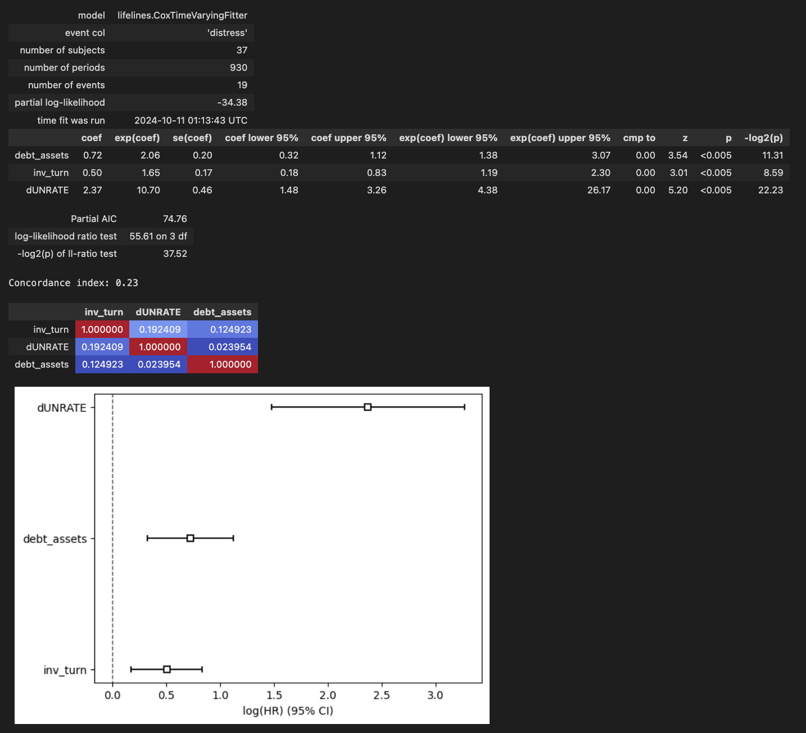

# New idea

Clarify what I've already done:
- What are we doing.
- What are the variables precisely.
- Put a representative screenshot of the database.

Study which variables influence the propbability to be close to max drawdown.

Ordered logistic regression
Make classes:
- Under 60% of the max drawdown.
- Attained 60% of the max drawdown.
- Attained 80% of the max drawdown.
- Attained 100% of the max drawdown (cut history after, or not?).

Logistic regression
or 2 classes:
- Within 80-100% of max drawdown
- Not within 80-100% of max drawdown

# **Study of the Causes that Led Financial Institutions to Bankruptcy During the 2008 Housing Bubble Using a Time-Dependent Cox Proportional Hazard Model**

This project aims to provide a quantitative explanation of the causes that led companies involved in speculation during the 2008 housing bubble to bankruptcy. It uses a variant of a model commonly applied in survival analysis: the **Cox Proportional Hazard Model**.

# Dataset

The dataset was created by querying data from [Wharton Research Data Services (WRDS)](https://wrds-www.wharton.upenn.edu/), the [Center for Research in Security Prices, LLC (CRSP)](https://www.crsp.org/), and the [Federal Reserve Bank of St. Louis](https://fred.stlouisfed.org/). It currently includes 37 companies, 19 of which experienced financial distress during the 2008 crisis.

It contains various financial ratios reported quarterly, categorized into three groups: Efficiency (e.g., Inventory Turnover), Financial Soundness (e.g., Short-Term Debt/Total Debt Ratio), and Solvency (e.g., Leverage Ratios). Additionally, the dataset includes macroeconomic variables (e.g., House Price Index, Mortgage Delinquency Rate) available monthly. Details about the ratios can be found [here](https://github.com/Gabriel-dLN/Project/blob/main/data_to_prepare/WRDS_Industry_Financial_Ratio_Manual.pdf).

For each variable, the first differences are also included, noted with a 'd' in front of the variable name (e.g., `dinv_turn` instead of `inv_turn`), to account for the effect of variable changes on the risk of distress.

The date range spans from **January 1, 2000, to January 1, 2010**.

Currently, all covariates have been normalized on a company-by-company basis.

Companies are labeled as "in distress" if they were in severe financial difficulty at some point between 2007 and 2009. This distress category includes companies that went bankrupt, were acquired, or received substantial government bailouts.

Although somewhat subjective, this classification is well-suited for the study. Many banks received assistance through the Troubled Asset Relief Program (TARP), but the reasons for this varied. For example, JPMorgan received TARP funds to facilitate its purchase of Bear Stearns, while Citigroup used the funds to pay off debt. Since these two cases are fundamentally different, it would not make sense to classify them in the same way. As a result, I’ve categorized Citigroup as "in distress" but not JPMorgan.

# Model

The model used throughout this project is a **Time Dependent Cox Proportional Hazard Model**.
### Model specification

### Hypothesis

More on that [here](https://bmcmedresmethodol.biomedcentral.com/articles/10.1186/1471-2288-10-20).

# Approach

The model is fitted using data from June 30, 2002, to January 1, 2010, to avoid any residual effects from the dot-com bubble. Each financial crisis is unique, with its own set of underlying causes and dynamics, and this study specifically focuses on explaining the 2008 subprime mortgage crisis.

### Potential biases
Thin limit between in distress and not.

# First results

The project is still in a research stage, but some interesting first results.

In the example below, a Time Dependant Cox Proportional Hazard Model is fitted on the data with the following covariates:
- debt_assets: Total Debt as a fraction of Total Assets.
- inv_turn: Inventory Turnover: COGS (Cost Of Goods Sold) as a fraction of the average Inventories based on the most recent two periods.
- dUNRATE: **Variation of** the unemployment rate: it represents the number of unemployed as a percentage of the labor force.<!--  Labor force data are restricted to people 16 years of age and older, who currently reside in 1 of the 50 states or the District of Columbia, who do not reside in institutions (e.g., penal and mental facilities, homes for the aged), and who are not on active duty in the Armed Forces.  -->

<!-- - rect_turn: Receivables Turnover: Sales as a fraction of the average of Accounts Receivables based on the most recent two periods -->
<!-- - ddebt_assets: **Variation of** Total Debt/Total Assets: Variation of the Total Debt as a fraction of Total Assets -->
<!-- - dinv_turn: **Variation of** Inventory Turnover: **Variation of** COGS as a fraction of the average Inventories based on the most recent two periods. -->

Using the table below, we can interpret the results:

Note that hazard ratios only make sense when compared across covariates. They cannot be interpreted alone.

All the p-values are under 0.05. The Model is then statistically significant.

### Covariate Interpretations

#### 1. **deb_assets (Debt to Assets Ratio)**
   - **Coefficient** = 0.72
   - **Hazard Ratio (exp(coef))** = 2.06
   - **Interpretation**: An increase in the debt-to-assets (or leverage) ratio is associated with an increase in the risk of distress. Indeed, a higher leverage ratio leads to more risks. This aligns with typical financial intuition— companies with higher debt relative to their assets are more likely to face financial strain, especially during downturns.
   <!-- Add interpretation of what were the financial products that were assets and what were debts -->

#### 2. **inv_turn (Inventory Turnover)**
   - **Coefficient** = 0.50
   - **Hazard Ratio (exp(coef))** = 1.65
   - **Interpretation**: An increase in inventory turnover is associated with an increase in the risk of distress. It particularly makes sense as a lot of companies that went bankrupt were financing themselves using overnight REPOs. This implies a higher risk in case of a decrease of the liquidity or of a high market volatility environment.

#### 3. **dUNRATE (Variation of the Unemployement rate)**
   - **Coefficient** = 2.37
   - **Hazard Ratio (exp(coef))** = 10.70
   - **Interpretation**: An increase in the variation of the unemployement rate is associated with an increase in the risk of distress.

### Comparison of the hazard ratios (the exp(coef))
We notice that the variation of the unemployment rate is the primary factor of distress, followed by the leverage ratio, which is closely followed by the inventory turnover.

<!-- #### 2. **rect_turn (Receivables Turnover)**
   - **Coefficient** = -1.03
   - **Hazard Ratio (exp(coef))** = 0.36
   - **Interpretation**: A one point increase in receivables turnover (companies are collecting their receivables more quickly) is associated with a **64% decrease** in the risk of distress. This ratio illustrates the exposure to other financial institutions and the liquidity of the lending market. Companies stuggling with collecting debt will also struggle to issue some, as they are less solvable. -->

<!-- #### 1. **dinv_turn (Variation in Inventory Turnover)**
   - **Coefficient** = 0.38
   - **Hazard Ratio (exp(coef))** = 1.46
   - **Interpretation**: Higher variations in inventory turnover increases the risk of distress by **46%**. In fact, companies with a lot of short term debt are more vulnerable during liquidity crisis. -->

### Multicollinearity Consideration
The correlation matrix at the bottom shows relatively low correlations between the covariates (the maximum is 0.19). This suggests that multicollinearity is not a significant issue in the model, meaning the estimated effects of each covariate are likely reliable.

### Concordance Index
The concordance index is 0.23, which suggests the model has no predictive ability. While the coefficients are statistically significant and align with reasonable interpretations, the overall model’s ability to correctly rank companies by their risk of distress is low.

This isn't much of a problem as the model has no predictive purpose. Having a low concordance index but statistically significant variables is still relevant: the model shows that the 3 covariates have a real impact on the hazard ratio and so, the probability to be in distress.

Other effects can be responsible for the difficulty to obtain a model with high a concordance ratio:
- The data used for this study is reported quarterly so the duration between the beginning and end of the quarted isn't taken into account and companies categorized as in distress in the same quarter are noted the same day.
- The precision of the distress category is vague, so the order in which the companies go bankrupt is very approximate.
- A lot depends on human intervention, government policies and other events that are not quantifiable.
- Bad quality data.
- Sometimes the data of the companies that were in distress and those who were not are very similar, as each of them was highly impacted by the crisis. Adding companies from different sectors would not really make sense because they are different businesses so different ways of working and could dilute the relevant information.
